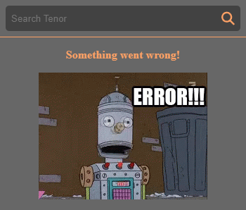
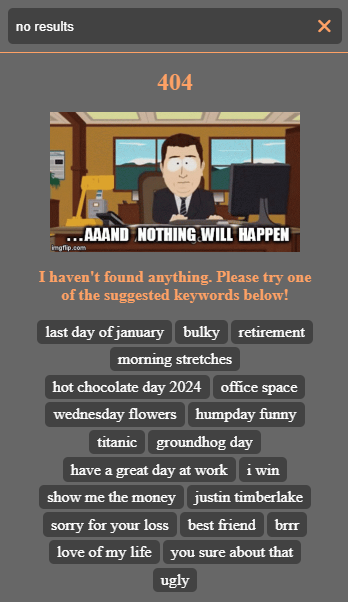

# Gif Picker React Control


A React component that offers a GIF picker control with a GIF search engine powered by [Tenor API V2](https://developers.google.com/tenor).

## Before using

You need to provide a Tenor API V2 key in order to use this component. You can obtain a key from [here](https://developers.google.com/tenor).

## Installation

```bash
npm install gif-picker-react
```

or

```bash
yarn add gif-picker-react
```

## Usage

```js
import { GifPicker } from "react-gif-picker-control";

const App = () => {
    return (
        <div>
            <GifPicker
                tenorApiKey={"YOUR_API_KEY"}
                onGifClick={"YOUR_FUNCTION_TO_HANDLE_THE_GIF_SELECTION"}
            />
        </div>
    );
};
```

## Props

### Required

| Prop        | Type       | Description                                                                                                   |
| ----------- | ---------- | ------------------------------------------------------------------------------------------------------------- |
| tenorApiKey | `string`   | Your [Tenor API key](https://developers.google.com/tenor) for powering the GIF search engine                  |
| onGifClick  | `function` | Callback function triggered when a GIF is clicked. The function has one parameter which is [Gif](#gif) object |

### Optional

| Property       | Type      | Default value | Description                               |
| -------------- | --------- | ------------- | ----------------------------------------- |
| searchLimit    | `number`  | `50`          | Define the limit for search results       |
| hideCategories | `boolean` | `false`       | Hide or show GIF categories in the picker |
| autoFocus      | `boolean` | `true`        | Auto-focus on the GIF search input        |

### Styling

| Property            | Type           | Default value                                                                    | Description                                        |
| ------------------- | -------------- | -------------------------------------------------------------------------------- | -------------------------------------------------- |
| colors              | `ColorPalette` | `{ primary: '#424242', accent: '#FFA25F', background: '#676767', text: '#FFF' }` | Customize the color palette of the GIF picker      |
| containerDimensions | `Dimension`    | `{ width: 350, height: 450 }`                                                    | Set custom dimensions for the GIF picker container |

### Images

| Property          | Type     | Default value                                                                   | Description                               |
| ----------------- | -------- | ------------------------------------------------------------------------------- | ----------------------------------------- |
| imageErrorUrl     | `string` | [The Simpsons](https://media.tenor.com/OxvVRFnPZO8AAAAC/error-the-simpsons.gif) | Image src for displaying GIF error state  |
| imageNoResultsUrl | `string` | [South Park](https://media.tenor.com/jJHoqBHOqVkAAAAC/animated-cartoon.gif)     | Image src for displaying no results state |

### Gif

| Property    | Type     | Description                                 |
| ----------- | -------- | ------------------------------------------- |
| id          | `string` | Tenor result ID                             |
| description | `string` | A brief description associated with the GIF |
| urlPreview  | `string` | The URL of a thumbnail for the GIF          |
| urlMedia    | `string` | The URL of the actual GIF media file        |
| width       | `number` | The width of the GIF in pixels              |
| height      | `number` | The height of the GIF in pixels             |
| createdAt   | `Date`   | The date when the GIF was created or added  |

## Other screens

### Error



### No results


